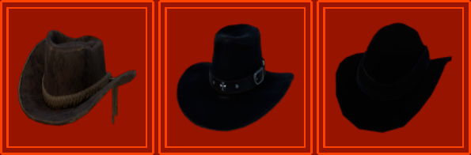
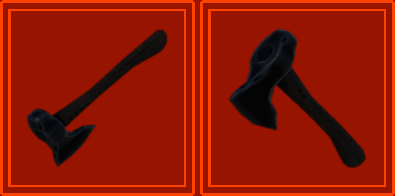
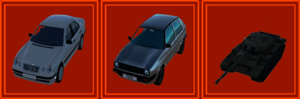
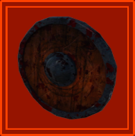
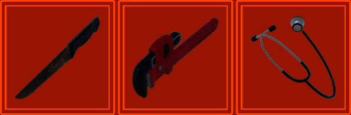
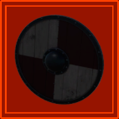
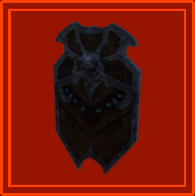
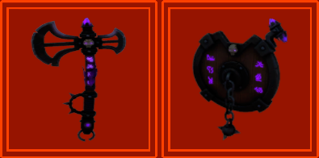
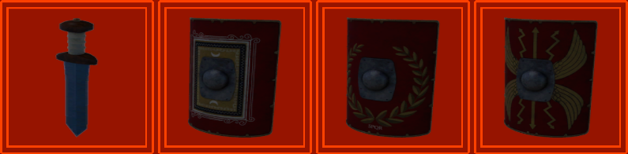
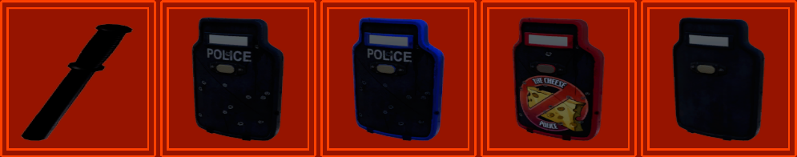

# LC-MoreCompanyCosmetics
I added more cosmetic items for Lethal Company(v45) MoreCompanyCosmestics(v1.7.2) mod by [@notnotnotswipez](https://github.com/notnotnotswipez/MoreCompany)

## List
- [Version 1.0.0 Package List](#v100)
  > axehat, axehat2, christmasgiftbox, cowboyhat, cowboyhat2, cowboywomanhat, crown, pajamahat, plagueblackleatherhat, plagueblackleathermask, plaguebrownleatherhat, plaguebrownleathermask, showercap, sombrerohat, trafficcone, vikinghelmet

- [Version 1.0.1 Package List](#v101)
  > axeaccessory, hammer, hoe, pickaxe, scythe, spade, hatchback1988, sedan, tank-t54, pumpkin, vikingshield, rustyknife, pipewrench, stethoscope

- [Version 1.0.2 Package List](#v102)
  > fantasyaxe, fantasyshield, policecop, policeshield, policeshieldblue, policeshieldcheese, policeshieldplain, romangladius, romanshield, romanshield2, romanshield3, skullshield, vikingshield2

## v1.0.0

- Cowboy Hats

    

- Plague Leather Masks & Hats

    

- Stucked Axes on Head

    

- Christmas Gift Box, Crown, Pajama Hat, Shower Cap, Sombrero Hat, Traffic Cone, Viking Helmet

    

## v1.0.1

- Tool Set Accessories

    

- Vehicles (Hatchback 1988, Sedan, T-54 Tank)

    

- Pumpkin

    

- Viking Shield

    

- Rusty Knife, Pipe Wrench, Stethoscope

    

## v1.0.2

- Viking Shield 2

    

- Skull Shield

    

- Fantasy Axe and Shield

    

- Roman Shields and Gladius

    

- Police Shields and Cop

    

## License

The MIT License (MIT). Please see [License File](LICENSE) for more information.